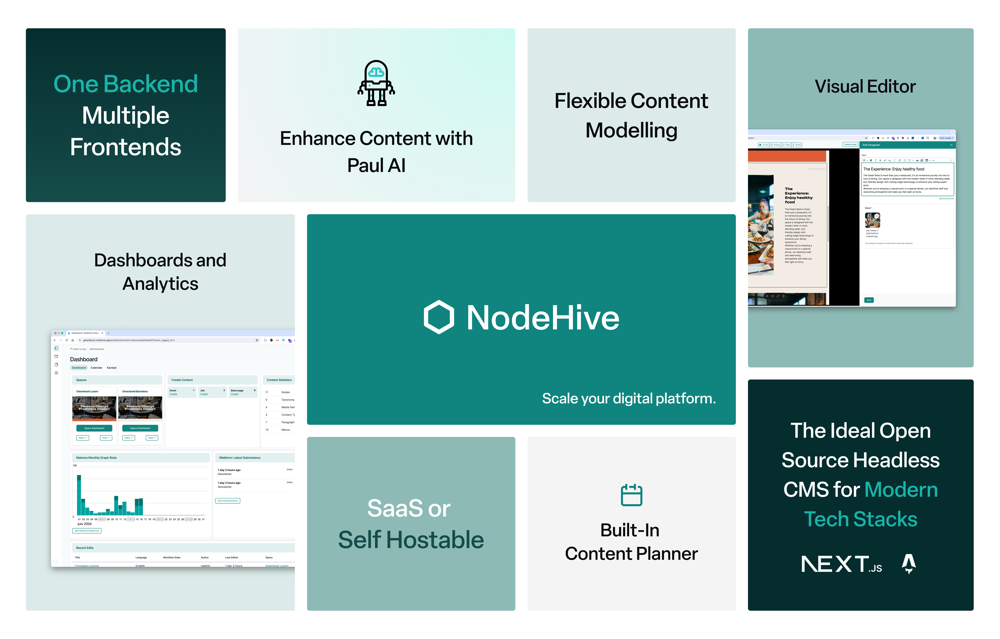

import { Card, CardGrid, Aside } from "@astrojs/starlight/components";

<Card title="What is NodeHive Headless CMS?">

NodeHive headless CMS is a headless composable platform that serves as your central commerce, marketing, communication and customer engagement hub.

<Aside type="tip" title="NodeHive is ...">
  - "Everything you need to run multiple websites from one backend" - "The open
  source platform for the composable web" - "The go to solution for Drupal
  headless solutions"
</Aside>

</Card>

## NodeHive Headless CMS Features

NodeHive is a easy to use Headless/Composable CMS with rich enterprise features. It's API-first (GraphQL, JSON-Api, Rest), Open-Source and Eco-concious. Power all your frontends from one backend.

- One Backend, Multiple Frontends
- Flexible Content Modelling
- Visual Editor
- Multilingual Support
- Content Planning & Content Workflows
- Media Management
- APIs
- Rules Engine
- Commerce Tools

Visit https://www.nodehiveapp.com for vidoes and additional information.

---

## Subscribe our newsletter

[www.nodehive.com/newsletter](https://www.nodehive.com/newsletter).

## Guides

<CardGrid stagger>
  <Card title="Content Modelling" icon="pencil">
    Learn more about the [content modelling
    capabilities](/guides/content-modelling/) of NodeHive.
  </Card>
  <Card title="nodehive-js sdk" icon="add-document">
    Learn more about the JavaScript SDK so integrate NodeHive in your frontend.
  </Card>
  <Card title="Videos" icon="youtube">
    Watch our [video tutorials](/overview/videos/)
  </Card>
  <Card title="NodeHive Website" icon="setting">
    Learn more about the product on [www.nodehive.com](https://www.nodehive.com)
  </Card>
</CardGrid>
